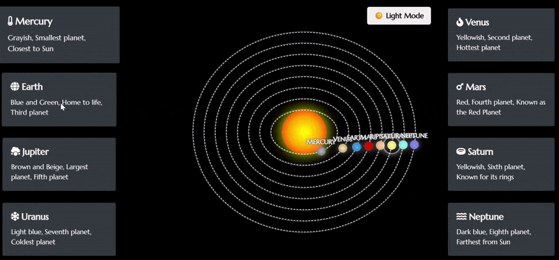
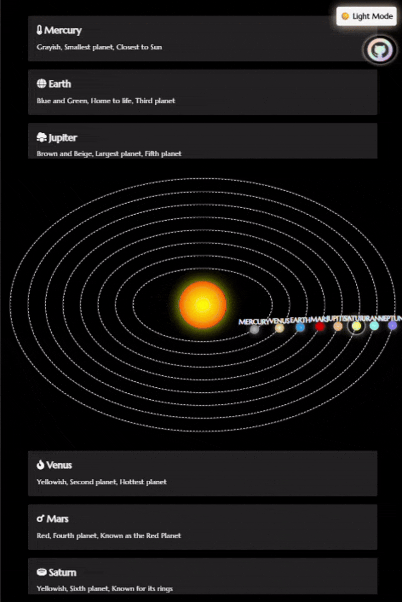
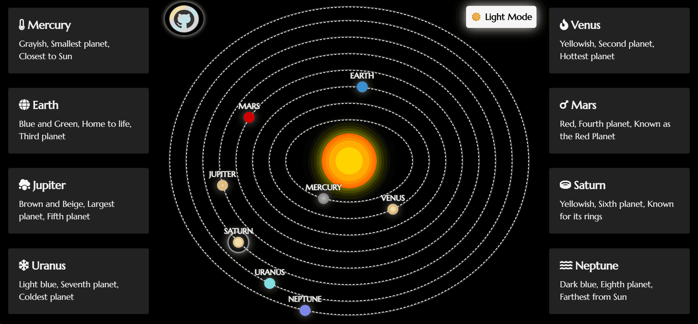
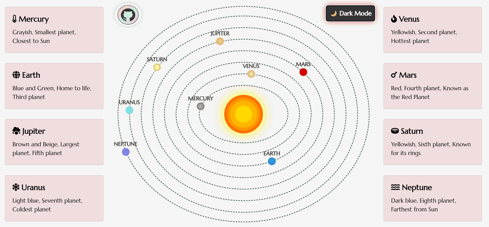

# 🌌 Animated Solar System 🌌

This project is an **interactive solar system visualization** using pure **HTML, CSS, and JavaScript**. It creatively represents each planet with beautiful animations and dynamic UI elements.

<!-- GitHub Project Badges -->
<p align="center">
  <a href="https://github.com/madhurimarawat/Animated-Solar-System/stargazers">
    
  </a>
  <a href="https://github.com/madhurimarawat/Animated-Solar-System/network/members">
    
  </a>
  <a href="https://github.com/madhurimarawat/Animated-Solar-System/issues">
    
  </a>
  <a href="https://github.com/madhurimarawat/Animated-Solar-System/blob/main/LICENSE">
    
  </a>
  <a href="https://github.com/madhurimarawat/Animated-Solar-System/watchers">
    
  </a>
  <a href="https://github.com/madhurimarawat/Animated-Solar-System">
    
  </a>
  <a href="https://github.com/madhurimarawat/Animated-Solar-System/commits/main">
    
  </a>
</p>

<p align="center">
<a href="https://madhurimarawat.github.io/Animated-Solar-System">
</a>
<a href="https://madhurimarawat.github.io/Animated-Solar-System">

</a>
</p>

---

## ✨ Features

* 🌞 Glowing Sun with realistic effects
* 🪐 Animated planetary orbits with gradient styling
* 🧠 Interactive cards showing info on hover
* 🌗 Light/Dark mode toggle for user preference
* 🎯 Fully responsive layout using Bootstrap
* ⭐ Font Awesome icons for stylish visuals
* 🖋️ Elegant typography using Google Fonts
* 💻 Cross-device compatibility

---

## 🗂️ Directory Structure

```bash
📁 Animated-Solar-System/
├── 📄 index.html                # Main HTML page 🌐
├── 📁 css/
│   ├── 🎨 index.css             # Core styling for layout & animations
│   ├── 🌗 light-mode.css        # Styles for light theme
│   ├── 🌑 dark-mode.css         # Styles for dark theme
│   ├── 🪐 planets.css           # Orbit & planet-specific styles
│   ├── 📱 responsive-styles.css # Additional responsive adjustments
│   └── 🎯 targeted-devices.css  # Media queries for specific screen sizes
├── 📁 js/
│   └── 🧩 index.js              # JavaScript for interactivity & toggles
│   └── 🧩 mobile-index.js       # JavaScript for interactivity & toggles (Mobile)
├── 📁 snapshots/                # GIF previews
├── 📁 website_snapshots/        # Static theme snapshots (added)
│   ├── 🖼️ preview.png
│   └── 💡 preview-light.png
├── 📄 README.md                 # You're here! 📘
├── 📄 LICENSE                   # MIT License 📜
└── 📄 CONTRIBUTING.md           # Contribution guidelines 🤝
```

---

## 🛠️ Tech Stack & Dependencies

* **HTML5** – Semantic structure
* **CSS3** – Animations, themes, layout
* **JavaScript** – Dynamic interactivity
* **Bootstrap 4.5.2** – Grid and responsiveness 📦
* **Font Awesome 5.15.4** – Icons ⭐
* **Google Fonts (Marcellus)** – Clean typography 🖋️

---

## 🚀 Usage

> [!TIP]
> Just clone and open `index.html` in any browser!

```bash
git clone https://github.com/madhurimarawat/Animated-Solar-System.git
cd Animated-Solar-System
```

> [!NOTE]
> 📘 [Read the Contribution Guide](CONTRIBUTING.md)

### 🧩 Customize It

* Modify planet data via `data-info` attributes in `index.html` 🪐
* Tweak orbit styles and animations in `index.css` 🎨
* Adjust theme logic and interactivity in `index.js` 🧠

---

## 🖼️ Preview

<p align="center">
<a href="https://madhurimarawat.github.io/Animated-Solar-System">


</a></p>

---

## 📌 Todo / Future Enhancements

* Add moons and asteroid belts 🌑
* Planetary rotation animation 🔁
* Tooltip-based info instead of cards 🧾
* Add sound effects 🎧

---

## 🪐 Live Demo

> [!NOTE]
> Hosted on GitHub Pages platform.
> 
> [🔗 View it live](https://madhurimarawat.github.io/Animated-Solar-System)

---

## Thanks for Visiting 😄

- Drop a 🌟 if you find this repository useful.<br><br>
- If you have any doubts or suggestions, feel free to reach me.<br><br>
📫 How to reach me:  &nbsp; [](https://www.linkedin.com/in/madhurima-rawat/) &nbsp; &nbsp;
<a href ="mailto:rawatmadhurima@gmail.com"> </a><br><br>
- **Contribute and Discuss:** Feel free to open <a href= "https://github.com/madhurimarawat/Animated-Solar-System/issues">issues 🐛</a>, submit <a href = "https://github.com/madhurimarawat/Animated-Solar-System/pulls">pull requests 🛠️</a>, or start <a href = "https://github.com/madhurimarawat/Animated-Solar-System/discussions">discussions 💬</a> to help improve this repository!